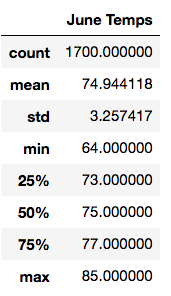
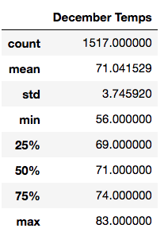
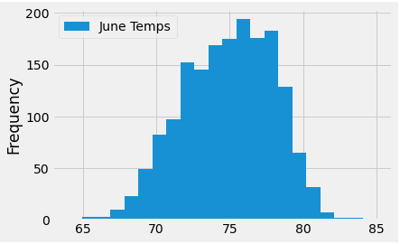
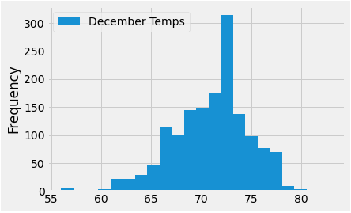

# surfs_up

## Analysis Overview

The purpose of this project was to determine the temperature trends for the city of Oahu, Hawaii in order to assist an investor named W. Avy in assessing whether the location would be reliable investment for a prospective surf and ice cream shop in the area.  To perform the analysis, the months of June and December were specifically targeted for inspection as the investor deemed these months would be adequately representative of a full year's weather.  The dataset included multiple years of temperature and precipitaiton data, spanning from 2010 through 2017, for nine different weather stations in Oahu and was contained in a SQLite database.  In order to query the SQLite database, Python programming language was used in combination with SQLalchemy and Pandas dependencies from within a jupyter notebook.

---------------------------------------------
## Resources:
Data Sources: hawaii.sqlite

Software: SQLite 3.32.3, SQLalchemy 1.3.18,\
Visual Studio Code 1.49.2, Python 3.8.3, Pandas 1.0.5,
Matplotlib 3.2.2

---------------------------------------------

## Results

From the analysis of the months of June and December in Oahu, we obtain the following statistical summaries (see below) for all of the nine weather stations.  Although many useful points could be made about this statistical summary, a few chosen key observations are summarized as follows:

- The average temperature for June is about 75 degrees, and in December it is about 71, indicating a relatively comfortable range for potential customers year-round.
- The lowest overall temperature for both months is 56 degrees, which occured in December, while the lowest for June was 64.
- The maximum temperature for both months is 85, which occurred in June, whereas the maximum for December was 83 degrees.

For additional perspective in analyzing the temperature patterns for June and December, we could also view a histogram to help us visualize the trends for each of the two months (as shown below).  As you can see, the statistical summary is consistent with the histogram visualizations.

## Summary

Following the analysis, it is evident the temperature ranges from 2010 through 2017 indicated Oahu's temperature patterns were mostly in the 70's year-round which may not be a deterrent from investing in a surf and ice cream shop somewhere in the city.  Although temperature perferences from customers are subjective, the data appears to support a reasonably comfortable average temperature for surfing and ice cream.

If we assume that a hotter temperature correlates positively to the number of people who will want to cool down by getting in the ocean to surf and eating ice cream, we may choose to examine when the temperature gets hottest to predict when customers may be incentivized to purchase surfing gear and ice cream.  As such, we see that 85 was the maximum temperature overall, which happened in June.  With temperatures like that, this may be a particularly profitable time for the business as people may like to be cooling off from the heat by getting in the ocean to surf and/or purchasing ice cream.  On the other hand, the minimum temperature of 56 may be a bit cold for such incentives.  However, we can see from the histogram above that these instances of 56 degrees were relatively rare occurances, even in December.  In fact, given that December also had a maximum value of 83 degrees, we see that 56 degrees was not necessarily representative of the norm.

## Additional Queries for Consideration:

In addition to the overall temperature statistics from all the stations, many other analyses could be made from this dataset which may be advisable for general investigation before committing to this investment in any particular location.  For instance, we could also investigate the variances in temperatures for each station.  This may allow us to be a bit more precise in selecting a location.  Also, we could compare the amount of precipitation for each of the nine weather stations.  If a particular weather station had the least rain year-round, perhaps that could influence the decision to have a shop nearer that location in general.  Furthermore, we could investigate whether the precipitation variances occured more often in different times of the year.  In essense, it may be generally a good idea to compare the temperature and precipitation trends for each station year-round, as well as for each month.